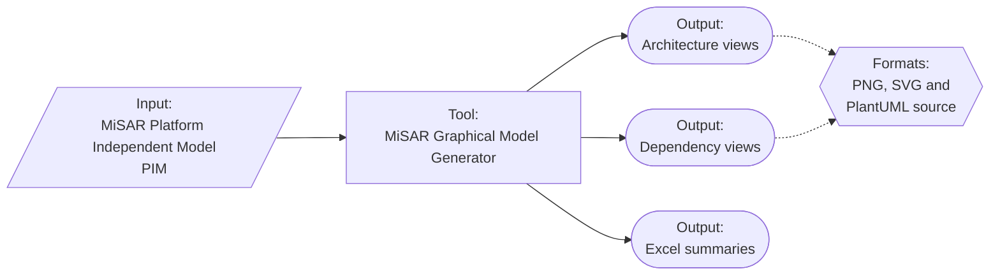

# MiSAR Graphical Model Generator

The **MiSAR Graphical Model Generator (GMG)** is the visualisation and reporting component of MiSAR. It accepts a MiSAR **Platform Independent Model (PIM)** and generates outputs that support architectural inspection, analysis, and reporting.

The GMG can produce architecture views, dependency views, UML-style diagrams, scalable SVG outputs, and Excel summaries containing recovered architecture metrics and component information.

> For normal users, the GMG is installed and updated automatically through the **[MiSAR All-in-One launcher](https://github.com/MicroServiceArchitectureRecovery/MiSAR-Parser-and-Model-Transformation)**. Manual repository use is primarily relevant to maintainers and contributors.

## Requirements

The MiSAR Graphical Model Generator requires:

- **Java Runtime Environment 21 or later**
- **OpenJDK 21** is the tested and recommended runtime

For normal users, the Graphical Model Generator is installed and updated automatically through the MiSAR AIO.

For current usage and troubleshooting guidance, use the [MiSAR documentation](https://microservicearchitecturerecovery.github.io/MiSAR-Parser-and-Model-Transformation/).

## Repository Role

## Related repositories

- **[MiSAR project overview](https://github.com/MicroServiceArchitectureRecovery/misar)**
- **[MiSAR Parser, Transformation Engine and AIO](https://github.com/MicroServiceArchitectureRecovery/MiSAR-Parser-and-Model-Transformation)**

## Documentation

Use the maintained guide for the current workflow and output descriptions:

- **[MiSAR documentation](https://microservicearchitecturerecovery.github.io/MiSAR-Parser-and-Model-Transformation/)**
- **[Create a PIM](https://microservicearchitecturerecovery.github.io/MiSAR-Parser-and-Model-Transformation/create-pim/)**
- **[Graphical Model Generator guide](https://microservicearchitecturerecovery.github.io/MiSAR-Parser-and-Model-Transformation/graphical-generator/)**

## Copyright

© 2020-2026 Dr Nour Ali, Brunel University London. All rights reserved. MiSAR is made openly available for research and evaluation purposes. The intellectual property and copyright of this tool and its associated research remain with Dr Nour Ali and Brunel University London.